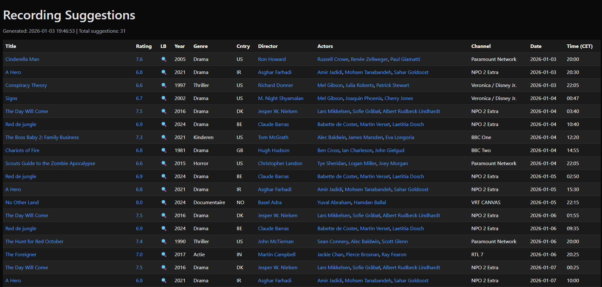
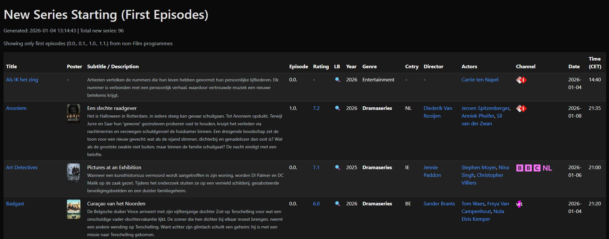

# EPG-Letterboxd Alerts

Combine Ziggo's EPG (XMLTV) with Letterboxd film data to generate personalized "What to Record" alerts and optionally schedule recordings via TVHeadend.

## Features

- 📺 Parse Ziggo XMLTV EPG using unofficial ziggogo-epg integration
- 🎬 Normalize film titles via TMDb API
- 📋 Letterboxd integration via CSV exports (no API needed)
- ⭐ Filter by ratings (user ratings from Letterboxd or TMDb community ratings)
- 🔴 Automatically schedule recordings via TVHeadend
- 🌐 Language and subtitle filtering (English/Dutch)
- ☁️ Runs as Azure Function (TimerTrigger)
- 💾 SQLite caching for efficient EPG updates





## Setup

### 1. Clone and Install

```bash
git clone https://github.com/frankvaneykelen/epg-letterboxd-alerts.git
cd epg-letterboxd-alerts
```

**Create and activate virtual environment:**

PowerShell:
```powershell
python -m venv .venv
.\.venv\Scripts\Activate.ps1
```

Command Prompt:
```cmd
python -m venv .venv
.venv\Scripts\activate.bat
```

**Install dependencies:**
```bash
pip install -r requirements.txt
```

### 2. Configure Environment Variables

Copy `.env.example` to `.env` and fill in your credentials:

```bash
cp .env.example .env
```

Edit `.env` (Letterboxd OAuth token only needed if using API mode instead of CSV):

```env
# TMDb API Configuration
TMDB_API_KEY=your_tmdb_api_key_here
```

**Important:** Never commit `.env` to version control. It's already in `.gitignore`.

### 3. Export Letterboxd Data

1. **Export your data from Letterboxd:**
   - Go to https://letterboxd.com/settings/data/
   - Click **Export your data**
   - Download the ZIP file to the `data` folder in this repo (keep the default name `letterboxd-*.zip`)

2. **Optional: Create a do-not-watchlist (blocklist):**
   - Create `data/do-not-watchlist.csv` to exclude unwanted movies from suggestions
   - See `data/do-not-watchlist.csv.example` for format
   - Useful for filtering out children's movies, documentaries you're not interested in, etc.
   - Supports ±1 year tolerance for matching (same as watched.csv)

3. **Enable in config.json:**
   ```json
   {
     "letterboxd": {
       "enabled": true
     }
   }
   ```

### 4. Configure Settings

Edit `config.json` for non-secret settings:

- EPG URL and cache directory
- Language preferences (`en`, `nl`)
- Minimum rating threshold
- Letterboxd CSV paths (if using Letterboxd)
- TVHeadend base URL and enable/disable

### 5. Azure Blob Storage Access (Local Development)

To test Azure Blob Storage integration locally, grant your Azure CLI user the Storage Blob Data Reader role:

```powershell
az role assignment create `
  --role "Storage Blob Data Reader" `
  --assignee $(az ad signed-in-user show --query id -o tsv) `
  --scope /subscriptions/<subscription-id>/resourceGroups/<resource-group>/providers/Microsoft.Storage/storageAccounts/<storage-account-name>
```

Replace:
- `<subscription-id>`: Your Azure subscription ID
- `<resource-group>`: Resource group name (e.g., `rg-epg-letterboxd-prod`)
- `<storage-account-name>`: Storage account name (e.g., `epgletterboxdprod`)

This allows the script to download Letterboxd exports from Azure Blob Storage when running locally. Without this role, it will log an `AuthorizationPermissionMismatch` warning and fall back to the local `downloads/` folder.

### 6. Local Testing

**Ensure virtual environment is activated** (you should see `(.venv)` in your prompt):

PowerShell:
```powershell
.\.venv\Scripts\Activate.ps1
```

Command Prompt:
```cmd
.venv\Scripts\activate.bat
```

**Run the function locally:**

```bash
python __init__.py
```

**What to expect:**
- Function will load configuration and environment variables
- Import/load Letterboxd CSV data (if enabled)
- Fetch EPG from configured URL
- Parse and filter broadcasts
- Match against TMDb and Letterboxd data
- Log recording suggestions

**Common issues:**

- **EPG fetch fails**: First run downloads several days of EPG data and may take a few minutes. Check your internet connection. Ziggo's API may also be temporarily unavailable - try again later.
- **TMDb API errors**: Verify your `TMDB_API_KEY` in `.env`
- **Letterboxd data not loading**: Run `python import_letterboxd.py` first or check CSV file paths in `config.json`
- **Import errors**: Make sure virtual environment is activated
- **Slow first run**: Normal! The first EPG fetch downloads multiple days of data. Subsequent runs use the cached database and are much faster.

**Tip:** Start with `letterboxd.enabled: false` to test EPG parsing and TMDb integration first, then enable Letterboxd once that works.

## Ziggo EPG Integration

This project uses the unofficial **ziggogo-epg** approach to fetch EPG data from Ziggo's online TV service. Since Ziggo doesn't provide a public EPG API, this is the only practical way to access their program guide.

### How It Works

1. Connects to Ziggo's web API (reverse-engineered from their online TV app)
2. Downloads program schedule segments (typically 6-hour blocks)
3. Caches data in SQLite database for efficiency
4. Generates standard XMLTV format

### Channel Configuration

Edit `data/channels.txt` to specify which channels to track:

```txt
# Your favorite channels
NPO 1
NPO 2
RTL 4
Film1 Premiere
Film1 Action
# etc.
```

Popular Dutch movie channels are pre-configured. You can add or remove channels as needed.

### Configuration

The Ziggo settings in `config.json`:

```json
{
  "ziggo": {
    "enabled": true,
    "channel_file": "data/channels.txt",
    "xmltv_file": "data/ziggogo.xml",
    "database_file": "data/ziggogoepg_cache.sqlite3",
    "scan_days": 24,
    "configuration": "ziggo-nl"
  }
}
```

- `scan_days`: Number of days to fetch (1-14, default 7)
- `channel_file`: Path to channel list file
- `database_file`: SQLite cache location

**Important**: Run the EPG fetcher **at most twice per day** to avoid overloading Ziggo's servers. The cache ensures subsequent runs are fast.

For detailed information, see [ZIGGOGO_EPG_INTEGRATION.md](ZIGGOGO_EPG_INTEGRATION.md).

## TV Series Discovery

The `list_non_films.py` script helps you discover new TV series starting on Ziggo channels. It automatically fetches EPG data and finds first episodes of series.

### Features

- 📺 Automatically fetches EPG from Ziggo (with SQLite caching)
- 🎬 TMDb integration for ratings and poster images
- 🔍 Filters for first episodes only (0.0., 0.1., 1.0., 1.1.)
- 🎯 Separate channel list for non-film content
- 📊 Interactive HTML output with sortable tables
- 🖼️ Poster images with modal viewer
- 🔗 Direct links to Ziggo TV, TMDb, and Letterboxd

### Usage

```bash
python list_non_films.py
```

The script will:
1. Fetch EPG data from Ziggo (64 channels configured in `data/channels-series.txt`)
2. Filter for non-film programmes (excludes: Film, Kinderen, Reality, etc.)
3. Find first episodes of new series
4. Look up ratings and posters from TMDb
5. Generate an HTML report in `data/new-series-{timestamp}.html`

### Configuration

Edit `data/channels-series.txt` to customize which channels to scan:

```txt
# Entertainment channels
NPO 1
NPO 2
RTL 4
NET5
# etc.
```

The script uses the same TMDb API key and SQLite cache as the main function.

## Deployment to Azure

### Infrastructure Deployment

Deploy the complete Azure infrastructure using Bicep:

```bash
# Create resource group
az group create --name rg-epg-letterboxd-prod --location westeurope

# Deploy infrastructure
az deployment group create \
  --resource-group rg-epg-letterboxd-prod \
  --template-file infra/main.bicep \
  --parameters tmdbApiKey=YOUR_TMDB_API_KEY
```

This creates:
- Function App (Python 3.11, Consumption Plan)
- Storage Account with Managed Identity access
- Application Insights
- Blob container for Letterboxd exports

See [infra/README.md](infra/README.md) for detailed deployment instructions.

### Code Deployment via GitHub Actions

#### Prerequisites

- Azure Function App deployed (using Bicep above)
- GitHub repository secrets configured

#### GitHub Secrets Required

Configure these in GitHub Settings → Secrets and variables → Actions:

1. **Get the publish profile from Azure Portal**:
   - Navigate to your Function App in the Azure Portal
   - Click **"Get publish profile"** or **"Download publish profile"** in the top toolbar
   - This downloads a `.PublishSettings` XML file

2. **Add secrets to GitHub**:
   - Go to your GitHub repository
   - Click **Settings** → **Secrets and variables** → **Actions**
   - Click **"New repository secret"** for each:
   
   **Secret 1:**
   - Name: `AZURE_FUNCTION_APP_NAME`
   - Value: `epg-letterboxd-prod-func` (or your Function App name from Bicep deployment)
   
   **Secret 2:**
   - Name: `AZURE_FUNCTION_PUBLISH_PROFILE`
   - Value: Open the downloaded `.PublishSettings` file and paste the entire XML content

#### Application Settings (configured via Bicep)

The following environment variables are set automatically by the Bicep deployment:

- `TMDB_API_KEY`: TMDb API key (from deployment parameters)
- Application Insights connection strings
- Storage account connection strings

#### Deploy

Push to `main` branch to trigger automatic deployment via GitHub Actions:

```bash
git add .
git commit -m "Initial deployment"
git push origin main
```

## Project Structure

```
epg-letterboxd-alerts/
├── __init__.py              # Main Azure Function entry point
├── function_app.py          # Azure Functions app configuration
├── list_non_films.py        # TV series discovery tool (first episodes)
├── epg_parser.py            # XMLTV EPG parser
├── tmdb_client.py           # TMDb API client
├── letterboxd_client.py     # Letterboxd API client (legacy)
├── letterboxd_csv_loader.py # Letterboxd CSV data loader
├── config.json              # Non-secret configuration
├── requirements.txt         # Python dependencies
├── .env.example             # Environment variable template
├── data/                    # Letterboxd CSV exports (gitignored)
│   ├── letterboxd_watchlist.csv
│   └── letterboxd_diary.csv
└── .github/
    └── workflows/
        └── deploy.yml       # CI/CD workflow
```

## How It Works

1. **Fetch EPG** – Download Ziggo XMLTV feed
2. **Parse & Filter** – Extract broadcasts, filter by language/subtitles
3. **Normalize** – Match titles to TMDb for canonical IDs
4. **Enrich** – Load Letterboxd CSV data (watchlist/seen/ratings)
5. **Decide** – Suggest recording if:
   - (Letterboxd enabled) film on watchlist OR not seen OR rating ≥ threshold

## Configuration Options

### `config.json`

```json
{
  "filters": {
    "languages": ["en", "nl"],
    "min_rating": 7.0,
    "include_subtitles": true
  },
  "letterboxd": {
    "enabled": false,
    "mode": "csv",
    "watchlist_csv": "data/letterboxd_watchlist.csv",
    "diary_csv": "data/letterboxd_diary.csv"
  },
  "tvheadend": {
    "enabled": false,
    "base_url": "http://localhost:9981"
  }
}
```

### Timer Schedule

Default: Every 6 hours. Modify in `function_app.py`:

```python
@app.timer_trigger(schedule="0 */6 * * * *")  # Cron expression
```

## API Keys & Data Sources

- **TMDb API**: Get free API key at https://www.themoviedb.org/settings/api
- **Letterboxd**: Export CSV files from your profile (no API needed)
- **TVHeadend**: Local installation credentials

## License

See [LICENSE](LICENSE) file for details.

## Contributing

Pull requests welcome! Please ensure code follows existing style and includes tests.


Smart alerts for films worth recording — powered by Ziggo EPG + Letterboxd.

---

## 📖 Overview

`epg-letterboxd-alerts` is an Azure‑hosted pipeline that combines Ziggo’s Electronic Program Guide (EPG) with Letterboxd film data to generate personalized recording suggestions.

The goal: never miss a broadcast of a film you care about. By cross‑referencing live TV schedules with your Letterboxd watchlist and ratings, the app flags broadcasts that match your preferences and can optionally schedule recordings via TV
